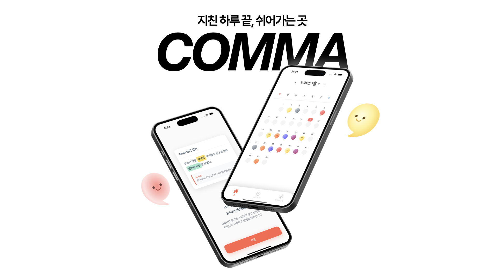
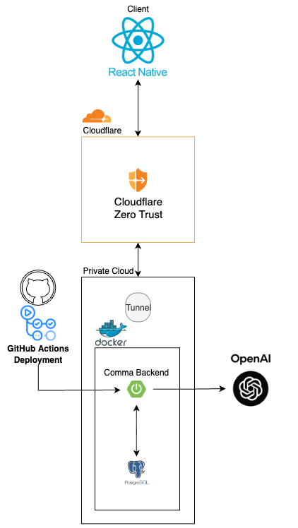

<h1 align="center">COMMA</h1>

<p align="center">
  
</p>

## 1. 프로젝트 개요
### 개발 동기


## 서비스 소개

**쉼표**는 하루를 단순히 기록하는 것이 아니라, 그때의 **감정을 담아내는 데 초점을 맞춘 감정 중심 일기 서비스**입니다.  
“기억보다 중요한 건, 그때의 감정”이라는 메시지를 바탕으로, 사용자에게 하루를 돌아보고 스스로의 감정을 이해할 수 있는 시간을 제공합니다.

### 핵심 컨셉
- **감정 색상화**  
  일기의 전체 감정 톤에 따라 책의 색상이 결정되며, 다양한 감정이 섞인 날은 그라데이션 효과로 시각적으로 표현합니다.
- **AI 피드백**  
  AI가 사용자의 글을 분석해 부족한 감정 표현을 짚어주고, 스스로를 더 깊이 돌아볼 수 있도록 돕습니다.

### 주요 기능 및 시나리오
1. **일기 작성**  
   사용자는 하루를 마무리하며 간단히 일기를 작성합니다.
2. **AI 피드백**  
   AI가 사용자의 글을 분석해 부족한 감정 표현을 짚어주고, 스스로를 더 깊이 돌아볼 수 있도록 돕습니다.
3. **감정 하이라이트**  
   그날의 감정 키워드를 요약해 제공하며, 감정 패턴을 한눈에 파악할 수 있습니다.
---

### 개발 환경 및 방법

본 프로젝트는 **모바일 애플리케이션과 백엔드 서버를 통합적으로 운영**하기 위해 다음과 같은 환경과 방법을 기반으로 개발되었습니다.

#### 1. Frontend
- **개발 도구**: Visual Studio Code (VSCode)
- **프레임워크**: React Native
  React Native로 모바일 최적화 UI를 구현하고, 크로스 플랫폼 방식을 적용해 iOS와 Android를 동시에 지원합니다.

#### 2. Backend
- **프레임워크**: Spring Boot
- **언어**: Kotlin
- 서버 사이드 로직은 Spring Boot를 기반으로 구축하였으며, 데이터 접근 계층은 **Exposed ORM 프레임워크**를 활용하여 SQL 중심의 직관적인 데이터 조작이 가능하도록 하였습니다.
- 보안 강화를 위해 Spring Security 및 JWT 인증 방식을 적용하였습니다.

#### 3. Database
- **데이터베이스**: PostgreSQL
- 확장성과 안정성이 뛰어난 PostgreSQL을 기반으로 데이터 모델링 및 관리 전략을 수립하였습니다.

#### 4. AI Integration
- **OpenAI API** 연동
- 대화형 기능 및 인공지능 기반 서비스를 제공하기 위해 OpenAI API를 적용하여 프로젝트의 확장성과 지능형 기능을 강화하였습니다.

#### 5. DevOps & Deployment
- **빌드 및 배포**: Docker 기반 컨테이너 빌드
- **인프라**: 개인 서버 활용
- **보안 및 외부 접속**: Cloudflare
- **Docker**를 통해 일관된 빌드 및 배포 환경을 구성하였으며, 개인 서버에서 서비스가 안정적으로 운영되도록 하였습니다.
- 외부 접속 시 **Cloudflare tunnel**을 통한 트래픽 관리와 보안을 강화하여 안정적인 서비스 접근성을 확보하였습니다.

### 기능 명세서 및 API
**Swagger UI 접근**
```
https://comma.gamja.cloud/swagger-ui/index.html
```
---

## 2. 서비스 아키텍처

<p align="center">
  
</p>

## 3. 팀 소개

| **프로필** |  |  |  |  | |
| :-: |:-----------------------------------------------------------:|:------------------------------------------------------------:| :-: | :-: |:-: |
| **이름** |            **[김건환](https://github.com/ElroyKR)**            |             **[한동균](https://github.com/hdg5639)**            | **[서동섭](https://github.com/dongsubnambuk)** | **[손경락](https://github.com/ganglike248)** |**[이선민]()** |
| **역할** |                         Backend                         | Backend | Frontend |Frontend |Designer |


## 4. 요구사항

- kotlin 2.0
- Spring: 3.5.5

## 5. 주요 기능


---
## 6. 데모 영상

[YouTube에서 보기](https://www.youtube.com/watch?v=pt7qaqfACb0)

---

<p align="center">
  <strong>오늘의 감정을 남겨두고, 더 따뜻한 내일을 만나보세요.</strong>
</p>
